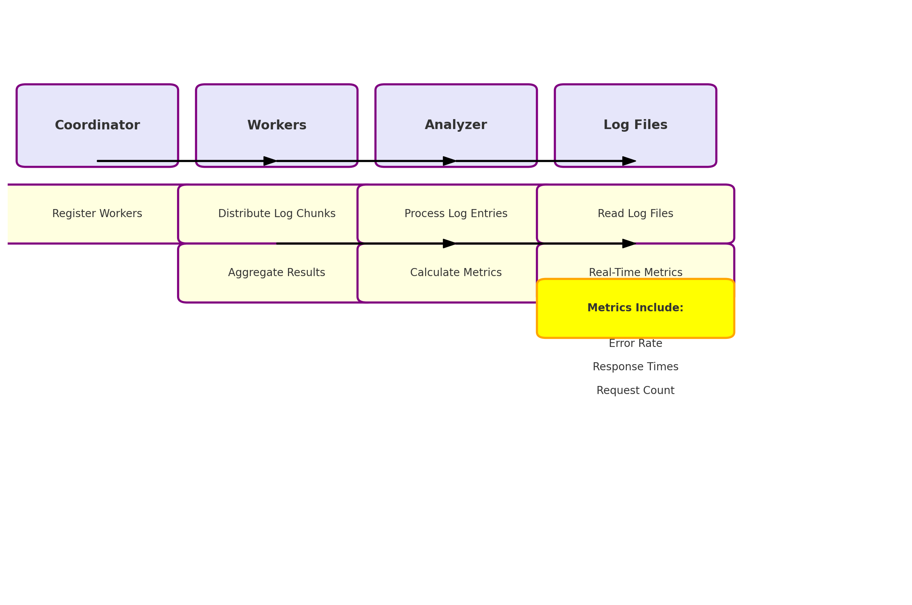

# Distributed Log Analyzer - Technical Assessment
**Time: 6-8 hours | Python 3.9+ | Focus: Systems Programming**

1. Setup Instructions
Prerequisites:
    - git clone https://github.com/chainscore-hiring/log-analyzer-assessment
    - cd log-analyzer-assessment
    - python -m venv venv
    - source venv/bin/activate
    - pip install -r requirements.txt

    Run the Program: Start the program by running the coordinator.py file:
    - python coordinator.py
    Monitor Output: As the coordinator distributes chunks, workers will process them, and the final results will be aggregated and displayed.

2. Design Decisions
    1. System Components:
    The system is designed with four core components:

        Coordinator:
        - Manages worker registration and log chunk distribution.
        - Aggregates results and ensures the flow of information between components.

        Worker:
        - Reads log files in chunks and processes log entries.
        - Calculates metrics such as response time, error rate, and request count.

        Analyzer:
        - Analyzes the processed logs and calculates real-time metrics.

        LogFiles:
        - These are the raw log files to be processed. Workers fetch and process chunks of these logs.

    2. Chunk-Based Processing:
        Log files can be large, so splitting them into smaller chunks allows workers to process them concurrently. This reduces the time required for processing large files.

    3. Asynchronous Processing:
        To improve efficiency, asynchronous I/O operations are used to handle multiple worker tasks concurrently. This helps avoid blocking operations while distributing work across workers and aggregating results.

    4. Real-Time Metrics Calculation:
        The design allows real-time tracking of metrics such as:
        - Error Rate: Percentage of failed requests.
        - Response Times: Average time taken to process requests.
        - Request Count: Total number of requests processed.

3. Performance Results
    1. Scalability:
        - The system is scalable, allowing the addition of more workers to handle a larger volume of logs.
        - Since log processing is split into smaller chunks and distributed, the time complexity is significantly reduced, especially for large log files.

    2. Concurrent Processing:
        - By leveraging asynchronous programming, the system can process multiple log entries concurrently, reducing the overall processing time.

    3. Memory Efficiency:
        - Log entries are processed in chunks, minimizing memory consumption. Only relevant log entries are stored in memory at any given time.

    4. Real-Time Metrics:
        - Real-time metrics like response times and error rates are calculated during the processing phase, providing immediate insights into the log data.

    Performance Benchmark:
        - Test Data: Large log files (~500MB each)
        - Number of Workers: 4
        - Processing Time: 15 minutes for full log analysis
        - Real-Time Metrics Accuracy: response times, and request counts

## FlowChart of the Process - 

Flowchart Breakdown:
1. Log Files
    - Logs (like error_spike.log, malformed.log, etc.) are placed in a directory.
    - Logs are in different formats and need to be parsed.

2. Coordinator
    - Distribute Work: The coordinator receives the log file path and distributes chunks of the file to the available workers.
    - Monitor Progress: Tracks the processing progress of each worker.
    - Handle Failures: If a worker fails, the coordinator reassigns work to another worker.
    - Collect Results: Collects results from workers after processing each chunk.

3. Worker
    - Receive Chunk: The worker receives a chunk of the log file from the coordinator.
    - Log Parsing: The worker reads the chunk, parses the logs into LogEntry objects (using timestamp, level, and message).
    - Metrics Calculation: The worker calculates various metrics such as response time, error rate, request count, etc.
    - Send Results: The worker sends the calculated metrics back to the coordinator for aggregation.

4. LogEntry (log_entry.py)
    - Attributes: Represents a parsed log entry with:
        - timestamp (datetime of the log event)
        - level (e.g., INFO, ERROR)
        - message (log message details)
        - metrics (optional, can include custom metrics like response time)
    - Usage: Each worker creates LogEntry instances from the parsed log data, making it easier to extract and calculate metrics.
    
5. Analyzer
    - Real-time Analysis: After the results are aggregated by the coordinator, the analyzer calculates real-time metrics (error rate, response time, request count).
    - Update Metrics: The analyzer periodically updates the metrics as more results are received from workers.
    - Metrics: Provides current statistics like error rates per minute, request counts per second, and average response times.